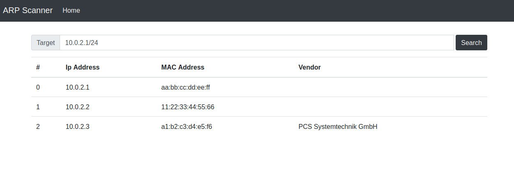

# Arp Scanner

## How to Run

### Meet Requirements
First of all, meet the requirements
```
pip install -r requirements.txt
```

### Runserver
```
sudo python3 arp_scanner.py
```

- Note: Root user privileges required.